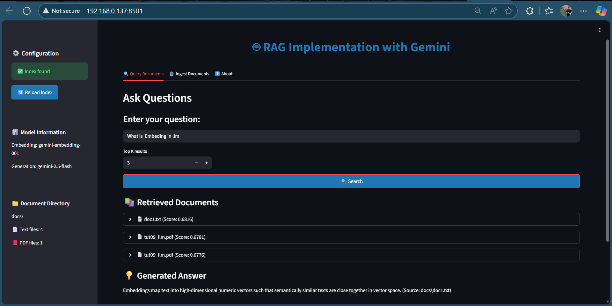

# RAG Implementation with Gemini

A complete Retrieval-Augmented Generation (RAG) system using Google's Gemini API for embeddings and text generation, with FAISS for vector similarity search.

**Author**: Sumanta Swain (sumanta_swain@epam.com)

## 📑 Table of Contents

- [Features](#-features)
- [Prerequisites](#-prerequisites)
- [Installation](#️-installation)
- [Usage](#-usage)
- [Project Structure](#-project-structure)
- [Configuration](#-configuration)
- [How It Works](#-how-it-works)
- [Testing](#-testing)
- [Sample Questions](#-sample-questions)
- [Sample Output](#-sample-output)
- [Troubleshooting](#-troubleshooting)
- [Development](#️-development)
- [Future Improvements](#-future-improvements)

## 🚀 Features

- **Document Ingestion**: Process and embed text and PDF documents using Gemini's embedding model
- **Intelligent Chunking**: Recursive character splitting strategy for better semantic boundaries
- **Semantic Search**: Find relevant documents using FAISS vector similarity search
- **Contextual Q&A**: Generate accurate answers using retrieved context with Gemini
- **Source Citation**: Automatically cite source documents in responses
- **Interactive CLI**: Easy-to-use command-line interface
- **Modern Web UI**: Beautiful Streamlit interface for a better user experience
- **PDF Support**: Native support for PDF documents using PyPDF2

## 📋 Prerequisites

- **Python 3.13+** - Required for running the application
- **Google API Key** - Get your free API key from [Google AI Studio](https://aistudio.google.com/app/apikey)
- **`uv` package manager** - Modern Python package manager (install from [uv.pm](https://github.com/astral-sh/uv))

**System Requirements**:
- Minimum 4GB RAM (8GB recommended for large document sets)
- Internet connection for API calls
- ~500MB disk space for dependencies and index files

## 🛠️ Installation

1. **Clone the repository**:
   ```bash
   git clone <your-repo-url>
   cd rag-implementation-gemini
   ```

2. **Install dependencies**:
   ```bash
   uv sync
   ```

3. **Set up your API key**:
   
   **Option A: Environment variable (recommended)**
   ```bash
   # Windows PowerShell
   $env:GOOGLE_API_KEY="your_api_key_here"
   
   # Linux/Mac
   export GOOGLE_API_KEY="your_api_key_here"
   ```
   
   **Option B: Create .env file**
   Create a `.env` file in the project root:
   ```
   GOOGLE_API_KEY=your_api_key_here
   ```

## 🚀 Usage

### Quick Start

1. **Install dependencies**:
   ```bash
   uv sync
   ```

2. **Set up API key** (create `.env` file or set environment variable):
   ```
   GOOGLE_API_KEY=your_api_key_here
   ```

3. **Add documents** to the `docs/` folder (`.txt` or `.pdf` files)

4. **Choose your interface**:
   - **Web UI** (recommended): `uv run streamlit run streamlit_app.py`
   - **CLI**: `uv run python main.py`

### Web UI (Recommended)

Launch the Streamlit web interface:
```bash
uv run streamlit run streamlit_app.py
```

The web UI provides:
- **Query Interface**: Ask questions with a modern, intuitive interface
- **Document Ingestion**: Process documents with visual feedback and progress indicators
- **Real-time Results**: See retrieved documents and generated answers instantly
- **Configuration Panel**: Monitor index status, model information, and document counts
- **Chunk Visualization**: See which chunks were retrieved from multi-chunk documents
- **Expandable Results**: Click to expand and view full document content

**Features**:
- Three tabs: Query Documents, Ingest Documents, and About
- Sidebar with system status and configuration
- Interactive document cards with similarity scores
- Clean, modern design with responsive layout

### Interactive CLI Mode

Run the main application:
```bash
uv run python main.py
```

You'll see a menu:
```
=== RAG with Gemini ===
1. Ingest documents
2. Ask a question
0. Exit
```

### Step-by-Step Process

1. **Ingest Documents** (Option 1):
   - Place your `.txt` or `.pdf` files in the `docs/` folder
   - Select option 1 to process and embed documents
   - Documents are automatically chunked using recursive character splitting
   - Creates FAISS index and metadata files

2. **Ask Questions** (Option 2):
   - Select option 2 to query your documents
   - Enter your question
   - Get contextual answers with source citations

### Test the System

Run the automated test suite:
```bash
uv run python test_rag.py
```

This will test the system with sample questions and show retrieval scores and generated answers.

## 📁 Project Structure

```
rag-implementation-gemini/
├── docs/                    # Place your .txt and .pdf documents here
│   ├── doc1.txt            # Sample AI/ML content
│   ├── doc2.txt            # Sample RAG content
│   └── document.pdf        # PDF documents supported
├── assets/                  # Images and other assets
│   └── web-ui-screenshot.png # Web UI screenshot for documentation
├── main.py                 # Main CLI application entry point
├── streamlit_app.py        # Streamlit web UI (recommended)
├── ingest_docs.py          # Document ingestion, chunking, and embedding
├── rag_query.py            # Query processing and answer generation
├── test_rag.py             # Automated test suite
├── pyproject.toml          # Project dependencies
├── README.md               # This file
├── faiss_index.bin         # Generated FAISS index (after ingestion)
└── docs_meta.pkl           # Generated document metadata (after ingestion)
```

## 🔧 Configuration

### Models Used

- **Embedding Model**: `gemini-embedding-001` - Generates vector embeddings for documents and queries
- **Text Generation Model**: `gemini-2.5-flash` - Generates contextual answers based on retrieved documents
- **Vector Search**: FAISS with cosine similarity - Fast similarity search using normalized vectors

### Customization

You can modify these settings in the respective files:

**Model Configuration** (in `ingest_docs.py` and `rag_query.py`):
```python
EMBED_MODEL = "gemini-embedding-001"  # Change embedding model
GEN_MODEL = "gemini-2.5-flash"        # Change generation model
```

**Retrieval Configuration** (in `rag_query.py`):
```python
def retrieve_topk(index, qvec, k=3):  # Change number of retrieved docs (default: 3)
```

**Chunking Configuration** (in `ingest_docs.py`):
```python
CHUNK_SIZE = 1000      # Adjust chunk size (default: 1000 characters)
CHUNK_OVERLAP = 200    # Adjust overlap (default: 200 characters)
```

**Document Directory** (in `ingest_docs.py`):
```python
DOCS_DIR = "docs"  # Change the directory where documents are stored
```

## 📊 How It Works

### Architecture Overview

The RAG system follows a three-stage pipeline:

```
┌─────────────────┐
│  Documents      │  (.txt, .pdf files)
│  in docs/       │
└────────┬────────┘
         │
         ▼
┌─────────────────────────────────────┐
│  Stage 1: Document Ingestion       │
│  • Read & parse documents           │
│  • Chunk using recursive splitting │
│  • Generate embeddings (Gemini)     │
│  • Build FAISS index                │
└────────┬────────────────────────────┘
         │
         ▼
┌─────────────────────────────────────┐
│  Stage 2: Query Processing         │
│  • Embed user question (Gemini)    │
│  • Search FAISS index (cosine)      │
│  • Retrieve top-k chunks            │
└────────┬────────────────────────────┘
         │
         ▼
┌─────────────────────────────────────┐
│  Stage 3: Answer Generation        │
│  • Combine context + question       │
│  • Generate answer (Gemini)         │
│  • Return with citations            │
└─────────────────────────────────────┘
```

### Detailed Process

1. **Document Processing**:
   - Reads all `.txt` and `.pdf` files from `docs/` folder
   - Splits documents into chunks using recursive character splitting (1000 chars with 200 char overlap)
   - Generates embeddings for each chunk using Gemini's embedding model (`gemini-embedding-001`)
   - Creates FAISS index for fast similarity search
   - Saves index and metadata to disk (`faiss_index.bin`, `docs_meta.pkl`)

2. **Query Processing**:
   - Embeds the user's question using the same embedding model
   - Normalizes the query vector for cosine similarity
   - Searches FAISS index for similar document chunks
   - Retrieves top-k most relevant passages with similarity scores
   - Returns chunk metadata (file path, chunk index, etc.)

3. **Answer Generation**:
   - Combines retrieved context chunks with the user's question
   - Constructs a prompt with context and question
   - Sends to Gemini text generation model (`gemini-2.5-flash`)
   - Returns answer with source citations and chunk information

## 🧪 Testing

The project includes comprehensive tests:

```bash
# Run automated tests
uv run python test_rag.py

# Test specific functionality
uv run python -c "from rag_query import load_index; print('Index loaded successfully')"
```

## 📝 Sample Questions

Try these questions with the included sample documents:

- "What is machine learning?"
- "How does RAG work?"
- "What are the benefits of RAG?"
- "What frameworks are mentioned for machine learning?"

## 📤 Sample Output

### CLI Output

After running `main.py` and selecting option 2 (**Ask a question**), the console output will look similar to this:

```text
=== RAG with Gemini ===
1. Ingest documents
2. Ask a question
0. Exit

Enter your choice: 2
Enter your question: What is Retrieval-Augmented Generation (RAG)?

Retrieved top documents (score, path):
0.8421  docs/doc2.txt [Chunk 1/3]
0.8013  docs/doc1.txt [Chunk 2/5]
0.7654  docs/doc2.txt [Chunk 2/3]

Generating answer using Gemini...

=== Answer ===

RAG (Retrieval-Augmented Generation) is a technique that combines retrieval of relevant documents
with a generative model to produce grounded, up-to-date responses.

[FILE: docs/doc2.txt]
```

**Note**: When documents are chunked, you'll see chunk information like `[Chunk 1/3]` indicating which chunk of the document was retrieved.

### Web UI Output

The Streamlit interface provides a modern, intuitive web-based experience for interacting with your RAG system:



**Key Features Visible in the Screenshot:**

- **Left Sidebar**:
  - **Configuration Panel**: Shows index status with a green checkmark when index is found
  - **Model Information**: Displays the embedding model (`gemini-embedding-001`) and generation model (`gemini-2.5-flash`)
  - **Document Directory**: Shows the `docs/` folder with counts of text files (4) and PDF files (1)
  - **Reload Index Button**: Allows you to refresh the index without restarting

- **Main Content Area**:
  - **Query Interface**: Clean input field for entering questions (example: "What is Embedding in llm")
  - **Top K Results Selector**: Adjustable slider to control how many documents to retrieve (default: 3)
  - **Retrieved Documents Section**: 
    - Shows document names with similarity scores (e.g., `doc1.txt` with score 0.6816)
    - Displays multiple chunks from the same document when relevant (e.g., `tut09_llm.pdf` appears twice with scores 0.6781 and 0.6776)
    - Expandable cards allow viewing full document content
  - **Generated Answer**: 
    - Clean, formatted answer display
    - Includes source citations (e.g., "Source: docs\\doc1.txt")
    - Provides context-aware responses based on retrieved documents

**Navigation Tabs**:
- **Query Documents**: Main interface for asking questions (shown in screenshot)
- **Ingest Documents**: Process and index new documents
- **About**: Project information and documentation

The interface demonstrates the complete RAG workflow: entering a question, viewing retrieved documents with similarity scores, and receiving a generated answer with proper source attribution.

## 🔍 Troubleshooting

### Common Issues

1. **API Key Error**:
   ```
   Set GOOGLE_API_KEY in .env or environment
   ```
   **Solution**: Ensure your API key is properly set

2. **Empty Documents Error**:
   ```
   The text content is empty
   ```
   **Solution**: Add content to your `.txt` files in the `docs/` folder

3. **Import Errors**:
   ```
   Import "faiss" could not be resolved
   ```
   **Solution**: Run `uv sync` to install dependencies

4. **PDF Reading Errors**:
   ```
   Warning: PyPDF2 not installed. PDF files will be skipped.
   ```
   **Solution**: Run `uv sync` to install PyPDF2, or manually install with `uv add PyPDF2`

5. **Streamlit Not Found**:
   ```
   streamlit: command not found
   ```
   **Solution**: Run `uv sync` to install Streamlit, then use `uv run streamlit run streamlit_app.py`

### Performance Tips

**Chunking**:
- Smaller chunks (500-800 chars) provide better precision but may lose context
- Larger chunks (1200-1500 chars) maintain more context but may be less precise
- The default 1000 chars with 200 overlap is a good balance for most use cases
- Adjust based on your document types (technical docs may need larger chunks)

**Retrieval**:
- Start with k=3 and adjust based on your needs
- Higher k values provide more context but may include irrelevant information
- Lower k values are faster but may miss relevant information

**Document Processing**:
- PDF files are processed page by page, so very large PDFs may take longer to ingest
- Consider splitting very large PDFs into smaller files for better performance
- The chunking strategy automatically handles large documents by splitting them intelligently

**General**:
- Consider using different embedding models for domain-specific content
- Monitor similarity scores - very low scores (<0.5) may indicate poor matches
- Re-index documents after making significant changes to your document set

## 🛠️ Development

### Chunking Strategy

The system uses **recursive character splitting** with intelligent boundary detection. This approach provides several benefits:

**Configuration** (in `ingest_docs.py`):
```python
CHUNK_SIZE = 1000      # Characters per chunk
CHUNK_OVERLAP = 200    # Overlap between chunks
```

**How it works**:
- Splits text into chunks of approximately `CHUNK_SIZE` characters
- Attempts to break at sentence boundaries (within the last 20% of chunk) for better semantic coherence
- Uses overlap (`CHUNK_OVERLAP`) to maintain context between adjacent chunks
- Handles documents of any size automatically

**Benefits**:
- ✅ Better semantic boundaries than fixed-size splitting
- ✅ Maintains context across chunk boundaries through overlap
- ✅ Handles large documents efficiently
- ✅ Improves retrieval accuracy by matching query to relevant chunks
- ✅ Reduces information loss at document boundaries

**Customization**: Adjust `CHUNK_SIZE` and `CHUNK_OVERLAP` in `ingest_docs.py` based on your document types and use case.

### PDF Support

PDF support is implemented using **PyPDF2**. The system automatically:
- Detects `.pdf` files in the `docs/` folder
- Extracts text from all pages sequentially
- Processes PDFs the same way as text files (with chunking)
- Handles multi-page documents seamlessly
- Provides error handling for corrupted or password-protected PDFs

**Supported PDF Features**:
- ✅ Multi-page document extraction
- ✅ Automatic text extraction from all pages
- ✅ Chunking support (large PDFs are split into manageable chunks)
- ✅ Error handling and graceful degradation

**Limitations**:
- Currently supports text-based PDFs only (not scanned images)
- Password-protected PDFs are not supported
- Complex layouts may require additional processing

**Adding More Formats**: To add support for other formats (e.g., `.docx`, `.md`), modify `read_documents()` in `ingest_docs.py`:

```python
def read_documents(path):
    # Add support for .docx using python-docx
    # Add support for .md files
    # Add support for other formats as needed
```

### Customizing Retrieval

Modify the retrieval logic in `rag_query.py`:

```python
def retrieve_topk(index, qvec, k=3):
    # Adjust similarity threshold
    # Add filtering logic
    # Modify scoring
```

### Web UI Customization

The Streamlit UI (`streamlit_app.py`) is highly customizable:

**Styling**: Modify the CSS in the `st.markdown()` section at the top:
```python
st.markdown("""
    <style>
    .main-header { ... }  # Customize header styling
    .stButton>button { ... }  # Customize button appearance
    </style>
""", unsafe_allow_html=True)
```

**Features**: 
- Add new tabs using `st.tabs()`
- Customize sidebar components
- Add new visualizations or metrics
- Integrate additional features like document upload, export, etc.

**Layout**: Streamlit's column system (`st.columns()`) allows flexible layouts

## 🔧 Future Improvements

The following features have been implemented:

✅ **Chunking Strategy**: Recursive character splitting with overlap for better semantic boundaries  
✅ **PDF Support**: Native PDF support using PyPDF2  
✅ **Web UI**: Modern Streamlit interface for enhanced user experience

### Potential Future Enhancements

- **Additional File Formats**: Support for Word documents (.docx), Markdown (.md), and more
- **Advanced Chunking**: Implement semantic chunking using sentence transformers
- **Metadata Filtering**: Filter documents by metadata (date, author, etc.)
- **Multi-modal Support**: Support for images and tables in documents
- **Export Functionality**: Export conversations and results
- **User Authentication**: Add authentication for multi-user scenarios

## 📄 License

This project is open source and available under the [MIT License](LICENSE).

## 🤝 Contributing

Contributions are welcome! Please feel free to submit a Pull Request.

## 📞 Support

If you encounter any issues or have questions, please open an issue in the repository.

---

**Happy RAG-ing! 🚀**
